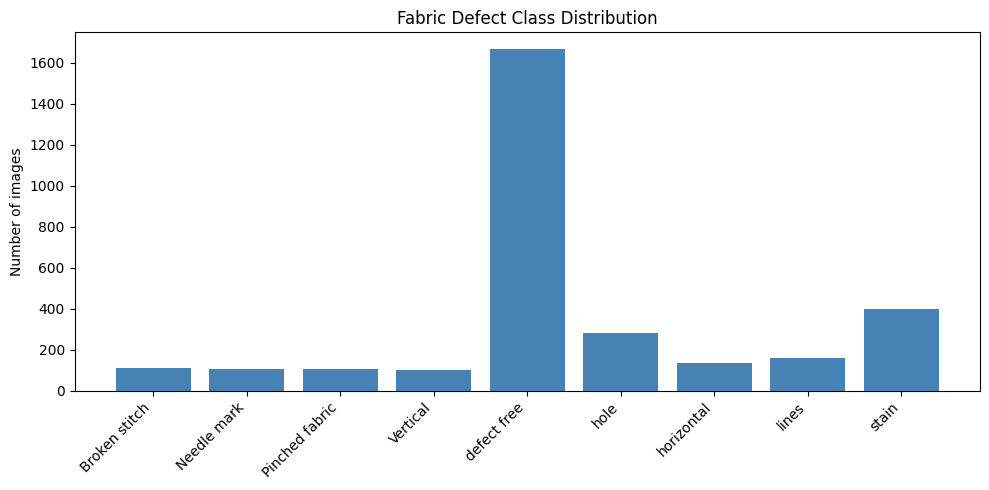
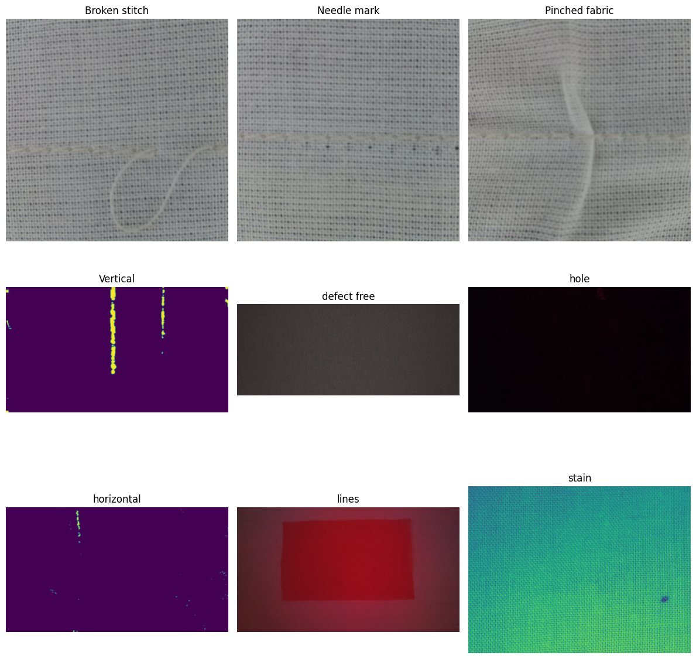
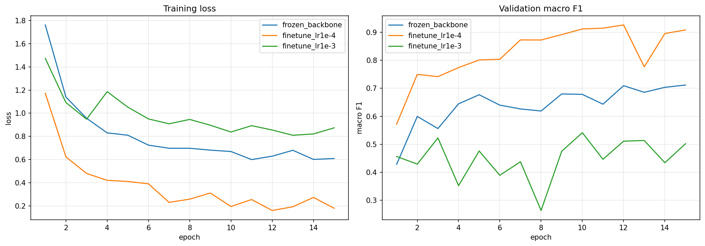
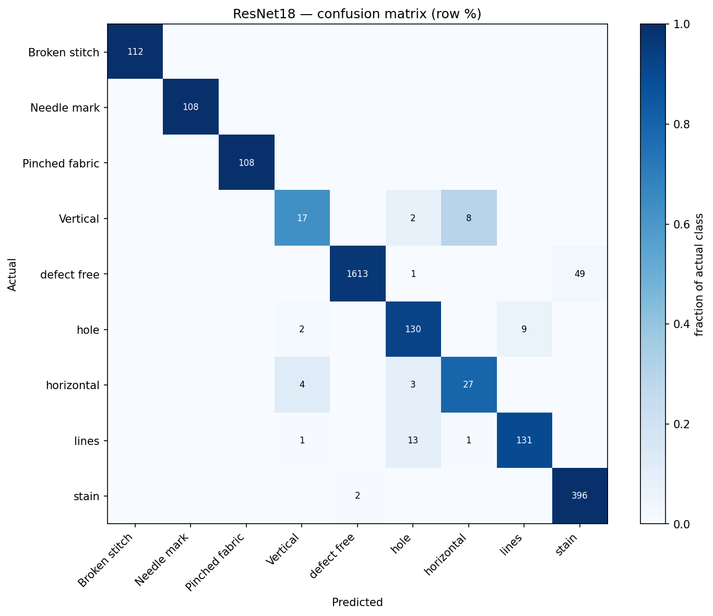
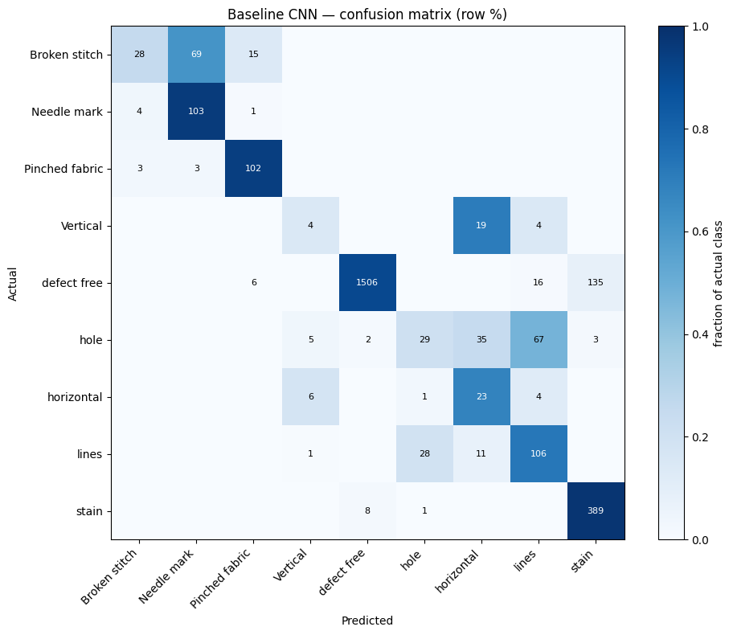

# Automated Fabric Defect Classification for Textile Quality Inspection Using Deep Learning

**Author:** Shakhnoza Abdusalomova
**Project track:** Track 1 — Individual Project Track
**Course:** AI/ML Fundamentals — Capstone Project

---

## Problem Statement

Quality inspection in textile manufacturing is done by hand. Inspectors watch fabric pass by and mark anything defective. The work is repetitive, tiring, and inconsistent — two inspectors often disagree, and the same inspector becomes less reliable towards the end of a shift.

The cost of a mistake is not symmetric. A defect that slips through reaches the customer and may cause a returned order; a false alarm only costs someone a second look at a good roll.

This project builds a computer vision system that classifies fabric images into eight defect types plus one "no defect" class, so inspectors can be supported by an automatic second opinion.

**Stakeholders:** quality inspectors on the production line, and the quality managers responsible for what leaves the factory.

---

## ML Task Type

**Multi-class image classification** (single label, 9 classes).

| | |
|---|---|
| **Input** | One fabric photograph, resized to 224×224 pixels in RGB colour |
| **Output** | One of nine class labels, with a confidence score |
| **Target** | The defect type recorded in the dataset's folder structure |
| **Classes** | 8 defect types + 1 normal class ("defect free") |

Because the dataset contains a normal class, the model answers both questions a factory cares about: *is this fabric defective?* and *what kind of defect is it?*

---

## Success Criteria

| Goal | Target | Achieved |
|---|---|---|
| Beat a simple CNN trained from scratch | > 0.583 macro F1 | **0.908** ✅ |
| Detect every defect type at some useful rate | recall > 0.5 on all 9 classes | 8 of 9 above 0.79; "Vertical" 0.63 ✅ |
| Keep missed defects low | < 2% of defects passed as normal | **0.2%** ✅ |
| Reproducible from the repository | fixed seed, documented steps | ✅ |

---

## Dataset

**Source:** [Multi-Class Fabric Defect Detection Dataset](https://www.kaggle.com/datasets/ziya07/multi-class-fabric-defect-detection-dataset) on Kaggle (`ziya07/multi-class-fabric-defect-detection-dataset`, version 3)
**Licence:** CC0: Public Domain
**Size:** ~2.1 GB, 3,067 image files across 9 class folders

The dataset is **not** stored in this repository. The notebooks download it automatically with `kagglehub`.

### After cleaning

Exploration found substantial duplication. Three separate checks removed 330 files:

| Stage | Images | Removed |
|---|---:|---:|
| Raw download | 3,067 | — |
| Removing pre-augmented `_processed` copies | 2,758 | 309 |
| Removing byte-identical duplicates | 2,741 | 17 |
| Removing near-identical images | **2,737** | 4 |

### Class distribution



| Class | Images | Share |
|---|---:|---:|
| defect free | 1,663 | 60.8% |
| stain | 398 | 14.5% |
| lines | 146 | 5.3% |
| hole | 141 | 5.2% |
| Broken stitch | 112 | 4.1% |
| Needle mark | 108 | 3.9% |
| Pinched fabric | 108 | 3.9% |
| horizontal | 34 | 1.2% |
| Vertical | 27 | 1.0% |

The largest class is **62 times** the size of the smallest. This drives most of the design decisions below.



---

## Project Pipeline

```
Raw Kaggle dataset (3,067 images)
        │
        ▼
┌─────────────────────────────────────────────┐
│ 01  Exploration                             │
│     class counts, image sizes, colour modes │
│     duplicate detection, source analysis    │
└─────────────────────────────────────────────┘
        │
        ▼
┌─────────────────────────────────────────────┐
│ 02  Preprocessing                           │
│     remove 330 duplicates  → 2,737 images   │
│     convert to RGB, resize to 224×224       │
│     5 stratified folds, class weights       │
└─────────────────────────────────────────────┘
        │
        ├──────────────────────┐
        ▼                      ▼
┌──────────────────┐   ┌──────────────────────┐
│ 03  Baseline CNN │   │ 04  ResNet18         │
│  built from      │   │  transfer learning   │
│  scratch         │   │  3 approaches tested │
│  → 0.583 macro F1│   │  → 0.908 macro F1    │
└──────────────────┘   └──────────────────────┘
        │                      │
        └──────────┬───────────┘
                   ▼
        Comparison and error analysis
```

---

## Models and Approaches Tested

Four approaches were trained and compared, all on the same five folds with the same augmentation, class weights, and random seed.

| Model | Setup | Macro F1 |
|---|---|---:|
| Baseline CNN | 4 conv blocks, 391,689 parameters, from scratch | 0.583 |
| ResNet18, frozen backbone | only the final layer trains (4,617 parameters) | 0.711 † |
| **ResNet18, fine-tuned at lr 1e-4** | **all 11.2M parameters train** | **0.908** |
| ResNet18, fine-tuned at lr 1e-3 | all parameters, larger steps | 0.502 † |

† validation score, measured during model selection



The third row is the important negative result: fine-tuning at a learning rate of 0.001 scored **worse than the baseline CNN**. Steps that large overwrite what the network learned from ImageNet in the first few batches, leaving damaged features and no time to relearn them.

---

## Final Model and Justification

**ResNet18, fully fine-tuned at learning rate 0.0001, 25 epochs.**

Chosen because:

1. **It scored highest on validation** — 0.908, against 0.711 for a frozen backbone and 0.502 for aggressive fine-tuning. The choice was made on fold 3, which was held out of that comparison.
2. **The gain over frozen features is large** (+0.197), showing the pretrained features genuinely benefit from adapting to fabric texture rather than being used as-is.
3. **It is stable across folds** — ±0.016, compared with the baseline CNN's less consistent behaviour.
4. **Fold 4 confirms it** — that fold played no part in choosing the approach and scored 0.895, in line with the rest, so the selection did not flatter the result.

---

## Evaluation Metrics and Results

### Why macro F1 rather than accuracy

With 60.8% of the data in one class, a model can reach high accuracy while ignoring every rare defect. **Macro F1** averages performance across all nine classes equally, so failing on the rare ones cannot be hidden. **Per-class recall** is reported separately, because in a factory a missed defect is the expensive error.

Every result below is from **5-fold cross-validation** — each image is predicted by a model that never saw it during training.

### Headline results

| Measure | Baseline CNN | **ResNet18** |
|---|---:|---:|
| **Macro F1** | 0.583 | **0.908** |
| Accuracy | 0.837 | 0.965 |
| Defects passed as normal | 10 of 1,074 (0.9%) | **2 of 1,074 (0.2%)** |
| Clean fabric wrongly flagged | 157 of 1,663 (9.4%) | 50 of 1,663 (3.0%) |

### Recall by class

| Class | Images | Baseline | ResNet18 | Change |
|---|---:|---:|---:|---:|
| Broken stitch | 112 | 0.250 | **1.000** | +0.750 |
| hole | 141 | 0.206 | 0.922 | +0.716 |
| Vertical | 27 | 0.148 | 0.630 | +0.482 |
| lines | 146 | 0.726 | 0.897 | +0.171 |
| horizontal | 34 | 0.676 | 0.794 | +0.118 |
| defect free | 1,663 | 0.906 | 0.970 | +0.064 |
| Pinched fabric | 108 | 0.944 | **1.000** | +0.056 |
| Needle mark | 108 | 0.954 | **1.000** | +0.046 |
| stain | 398 | 0.977 | 0.995 | +0.018 |

Every class improved and none got worse. Three classes are now classified perfectly in every fold.

### Confusion matrix



The remaining errors form one small cluster: "Vertical" and "horizontal" are confused with each other (8 and 4 images), and "hole" and "lines" trade a few between them. These are genuinely similar defects — thin marks whose direction is hard to judge at 224×224.

For comparison, the baseline CNN confused defects that look nothing alike:



---

## Installation

```bash
git clone https://github.com/shaxnozaabdusalomova2905/capstone-project.git
cd capstone-project
pip install -r requirements.txt
```

A Kaggle API token is needed for the dataset download. Create one at kaggle.com → Settings → API → *Create New Token*, then place `kaggle.json` at `~/.kaggle/kaggle.json`.

---

## Running the Project

All notebooks run in Google Colab or Kaggle without changes, and detect their environment automatically. A GPU is strongly recommended for notebooks 03 and 04.

Run them in order:

| Notebook | What it does | Runtime |
|---|---|---|
| `01_dataset_exploration.ipynb` | Explores the raw data and finds its problems | ~5 min |
| `02_data_preprocessing.ipynb` | Cleans, resizes, splits into folds | ~10 min |
| `03_baseline_cnn.ipynb` | Trains the baseline CNN across 5 folds | ~32 min (GPU) |
| `04_resnet18_transfer_learning.ipynb` | Compares 3 approaches, trains the final model | ~45 min (GPU) |

Notebooks 03 and 04 **rebuild the cleaned dataset themselves** if they cannot find it, using the same fixed seed. Each notebook therefore runs standalone in a fresh session, with no files to transfer between them.

### Training the final model

Open `04_resnet18_transfer_learning.ipynb` and run all cells. It will:

1. Rebuild the cleaned dataset if needed (~5 min)
2. Compare three ways of adapting ResNet18 (~9 min)
3. Train the winner across 5 folds (~32 min)
4. Save weights to `models/` and results to `outputs/resnet18/`

To change the training setup, edit the configuration block at the top of §1 (`IMG_SIZE`, `BATCH_SIZE`, `FINAL_EPOCHS`, `SEED`).

---

## Inference

Trained weights are included in this repository, so predictions can be made without retraining.

```python
import json, torch, torch.nn as nn
from PIL import Image
from torchvision import models, transforms

cfg = json.load(open("models/resnet18_config.json"))

model = models.resnet18()
model.fc = nn.Linear(model.fc.in_features, len(cfg["class_names"]))
model.load_state_dict(torch.load("models/resnet18_fold2.pt", map_location="cpu"))
model.eval()

tf = transforms.Compose([
    transforms.Resize((cfg["img_size"], cfg["img_size"])),
    transforms.ToTensor(),
    transforms.Normalize(cfg["normalize_mean"], cfg["normalize_std"]),
])

img = Image.open("your_fabric_image.jpg").convert("RGB")
with torch.no_grad():
    probs = model(tf(img).unsqueeze(0)).softmax(1)[0]

idx = int(probs.argmax())
print(f"{cfg['class_names'][idx]}  ({probs[idx]:.1%} confidence)")
```

### Example input and output

**Input:** a 1280×720 JPEG photograph of fabric with a visible hole

**Output:**
```
hole  (94.3% confidence)

All class probabilities:
  hole             0.943
  lines            0.031
  Vertical         0.012
  horizontal       0.008
  defect free      0.003
  stain            0.002
  Broken stitch    0.001
  Needle mark      0.000
  Pinched fabric   0.000
```

---

## Project Structure

```
capstone-project/
│
├── README.md
├── requirements.txt
├── .gitignore
│
├── notebooks/
│   ├── 01_dataset_exploration.ipynb
│   ├── 02_data_preprocessing.ipynb
│   ├── 03_baseline_cnn.ipynb
│   └── 04_resnet18_transfer_learning.ipynb
│
├── models/                      trained weights + settings needed to reload them
│   ├── baseline_cnn_fold0-4.pt
│   ├── baseline_cnn_config.json
│   ├── resnet18_fold2.pt
│   └── resnet18_config.json
│
├── outputs/                     metrics and figures per model
│   ├── baseline_cnn/
│   └── resnet18/
│
├── data/processed/              manifest.csv and class_weights.json only
│                                (images are regenerated, not stored)
├── assets/                      figures used in this README
└── docs/                        presentation materials
```

---

## Known Limitations

**"Vertical" and "horizontal" have too few images.** With 27 and 34 examples, their recall swings widely between folds — "Vertical" ranged from 0.333 to 0.833 and "horizontal" from 0.571 to 1.000. Their reported figures (0.630 and 0.794) should be read as approximate. No amount of training fixes this; only more data would.

**The dataset combines several source collections.** Filename patterns, image sizes, and colour formats differ by class, which means some classes could in principle be identified by their source rather than their content. Exploration confirmed that normal and defective images *do* share sources, so defect detection cannot rely on that shortcut alone, but a residual bias cannot be ruled out.

**Image size partly predicts the class.** Three classes are stored at exactly 224×224 while no other class contains that size. Resizing everything to a square removes this clue from the model's input, but it indicates the collections were assembled differently.

**No production batch information exists.** Ideally images from the same fabric roll would be kept together when splitting, so the model cannot recognise a roll it has already seen. The dataset records no roll or batch identifiers. Two attempts were made to recover grouping — from filenames, and by finding visually similar images — and neither found any. Scores may therefore be slightly optimistic.

**Grayscale storage is class-linked.** All 398 "stain" images are stored in grayscale while most other classes are in colour. Converting everything to RGB gives uniform input, but a grayscale image still looks colourless, so this remains a possible shortcut.

**Evaluated on one dataset only.** All results come from a single public dataset photographed under particular conditions. Performance on a different factory's cameras and lighting is unknown.

---

## Responsible AI Considerations

### Bias and representativeness

The training data is heavily imbalanced (62:1 between largest and smallest class) and drawn from a small number of source collections. The model has seen only certain fabric types, colours, and lighting conditions. It would likely perform worse on fabrics unlike those in the dataset — different weaves, patterns, or colours — and that failure would not be obvious from the metrics reported here.

Class weighting was used to stop the model ignoring rare defects, but weighting cannot create information that 27 images do not contain.

### Privacy and safety

The dataset contains photographs of fabric only. There are no people, faces, or personal data, so privacy risk is minimal. The dataset is released under CC0 (public domain).

The main safety consideration is **misplaced trust**. A system reporting 96.5% accuracy invites the assumption that it can replace human inspection. It cannot. It misses roughly 1 defect in 500, and its weakest classes are the rare ones — exactly the defects a human is least practised at spotting, and therefore where an automated second opinion would be most valuable and most likely to be trusted blindly.

### Appropriate and inappropriate use

**Appropriate:** as a second opinion alongside a human inspector; for flagging rolls that need a closer look; for gathering statistics on which defect types occur most often.

**Not appropriate:** as the sole decision-maker on whether fabric ships; for any safety-critical textile application (medical or protective equipment); on fabric types visibly unlike the training data; or as evidence in a commercial dispute over quality.

### Transparency

Every result in this README comes from 5-fold cross-validation on data the model never trained on. The negative result (fine-tuning at lr 0.001 performing worse than the baseline) is reported alongside the successes. Where numbers are unstable, ranges are given rather than single figures.

---

## Learning Outcomes

Through this project I strengthened my knowledge of computer vision, transfer learning, image classification, handling class imbalance, detecting data leakage, cross-validation, model evaluation, and reproducible ML engineering with Git and GitHub.

---

## Future Improvements

- Defect localisation with object detection, so the position of a defect is shown rather than only its type
- Collecting more images of the rare defect types, which is the single change that would most improve results
- Real-time inspection from an industrial camera feed
- Deployment to an edge device on the production line
- Defect severity estimation, to distinguish a flaw that matters from one that does not

---

## Licence and Acknowledgements

This project was developed for educational purposes as part of an AI/ML Fundamentals capstone project.

**Dataset:** Multi-Class Fabric Defect Detection Dataset by `ziya07`, published on Kaggle under **CC0: Public Domain**.

**Pretrained model:** ResNet18 with ImageNet weights, from `torchvision.models`.
